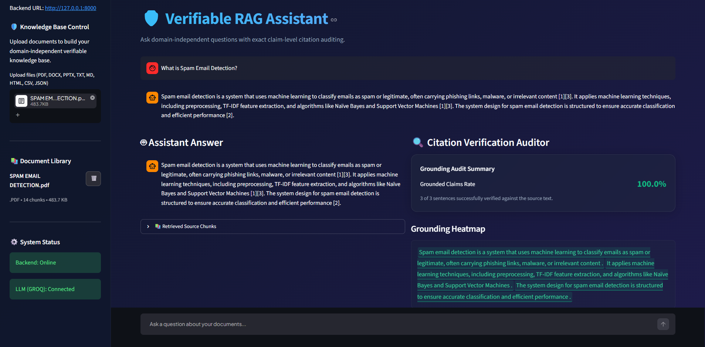

# 🛡️ Verifiable RAG Assistant

> A production-ready Retrieval-Augmented Generation (RAG) system that combines **Hybrid Retrieval**, **Groq-powered LLM inference**, and **Claim-Level Citation Verification** to generate trustworthy, source-grounded AI responses.


---

# 📖 Overview

**Verifiable RAG Assistant** is an AI-powered document question-answering system that allows users to upload documents, build a searchable knowledge base, and receive accurate answers backed by verifiable citations.

Unlike traditional RAG systems, this application performs **claim-level citation verification**, ensuring that generated responses are supported by retrieved source documents. By combining semantic search, keyword search (BM25), cross-encoder reranking, and automated grounding audits, the system improves transparency, reliability, and trust in AI-generated responses.

---

# 📸 Application Preview

<p align="center">
  
</p>

---

# ✨ Features

- 📄 Multi-format document ingestion (PDF, DOCX, PPTX, TXT, HTML, CSV, JSON, Markdown)
- 🔍 Hybrid Retrieval (Semantic Search + BM25)
- 🎯 Cross-Encoder reranking using **BAAI BGE Reranker**
- 🤖 Groq-powered LLM inference
- 💻 Optional Ollama support for local/offline inference
- 📚 Retrieval-Augmented Generation (RAG)
- 🛡️ Claim-Level Citation Verification
- 📊 Grounding Audit Dashboard
- ⚡ FastAPI REST API
- 🎨 Interactive Streamlit interface
- 📈 Health Monitoring Endpoint

---

# 🔄 How It Works

```text
Upload Documents
        │
        ▼
Document Parsing
        │
        ▼
Text Chunking
        │
        ▼
BAAI Embedding Model
        │
        ▼
ChromaDB Vector Store
        │
        ▼
Hybrid Retrieval
(Vector Search + BM25)
        │
        ▼
Cross-Encoder Reranker
        │
        ▼
Groq LLM
        │
        ▼
Citation Verification
        │
        ▼
Verified AI Response
```

---

# 🏗️ Architecture

```text
                  User
                   │
                   ▼
          Streamlit Frontend
                   │
                   ▼
            FastAPI Backend
                   │
       ┌───────────┼────────────┐
       ▼           ▼            ▼
 Document     Hybrid Search     LLM
 Parsing    (Vector + BM25)    (Groq)
       │           │            │
       └───────────┼────────────┘
                   ▼
        Cross-Encoder Reranker
                   │
                   ▼
       Citation Verification
                   │
                   ▼
        Verified AI Response
```

---

# 📂 Project Structure

```text
Verifiable-RAG-Assistant/
│
├── app/
│   ├── core/
│   ├── config.py
│   ├── database.py
│   └── main.py
│
├── frontend/
│   └── app.py
│
├── assets/
│
├── data/
│   └── .gitkeep
│
├── tests/
│
├── requirements.txt
├── README.md
├── LICENSE
└── .env.example
```

---

# 🛠️ Tech Stack

| Component | Technology |
|------------|------------|
| Language | Python |
| Backend | FastAPI |
| Frontend | Streamlit |
| LLM | Groq (Default), Ollama (Optional) |
| Vector Database | ChromaDB |
| Embedding Model | BAAI/bge-base-en-v1.5 |
| Reranker | BAAI/bge-reranker-base |
| Retrieval | Hybrid Retrieval (Semantic + BM25) |
| Database | SQLite |
| Document Parsing | PyMuPDF, python-docx, python-pptx, BeautifulSoup |

---

# 🚀 Installation

## 1. Clone the Repository

```bash
git clone https://github.com/nivas0408/verifiable-rag-assistant.git

cd verifiable-rag-assistant
```

---

## 2. Create a Virtual Environment

### Windows

```powershell
python -m venv .venv
.venv\Scripts\activate
```

### Linux / macOS

```bash
python3 -m venv .venv
source .venv/bin/activate
```

---

## 3. Install Dependencies

```bash
pip install -r requirements.txt
```

---

## 4. Configure Environment Variables

Copy:

```text
.env.example
```

to

```text
.env
```

Example:

```env
LLM_PROVIDER=groq
GROQ_API_KEY=YOUR_GROQ_API_KEY
```

Optional (Offline Mode):

```env
LLM_PROVIDER=ollama
```

---

## 5. Run the Backend

```bash
uvicorn app.main:app --reload
```

Backend:

```
http://localhost:8000
```

Swagger UI:

```
http://localhost:8000/docs
```

---

## 6. Run the Frontend

Open another terminal:

```bash
streamlit run frontend/app.py
```

Frontend:

```
http://localhost:8501
```

---

# 📡 API Endpoints

| Endpoint | Description |
|-----------|-------------|
| `/docs` | Swagger Documentation |
| `/health` | Health Check |
| `/upload` | Upload Documents |
| `/query` | Query the Knowledge Base |

---

# 📊 Example Health Response

```json
{
  "status": "healthy",
  "llm_available": true,
  "metrics": {
    "document_count": 2,
    "chunk_count": 86,
    "settings": {
      "llm_provider": "GROQ"
    }
  }
}
```

---

# 🎯 Future Enhancements

- [ ] Streaming LLM responses
- [ ] OCR support for scanned PDFs
- [ ] Authentication & user management
- [ ] Cloud vector database integration
- [ ] Semantic chunk visualization
- [ ] Configurable hybrid retrieval weights
- [ ] Multi-user workspaces

---

# 🤝 Contributing

Contributions are welcome!

1. Fork the repository.
2. Create a feature branch.
3. Commit your changes.
4. Submit a Pull Request.

---

# 📄 License

This project is licensed under the **MIT License**.

---

# 👨‍💻 Author

**Mulluri Nivas**

- GitHub: https://github.com/nivas0408
- LinkedIn: https://www.linkedin.com/in/mulluri-nivas-09053a31a/

---

⭐ **If you found this project helpful, consider giving it a Star!**