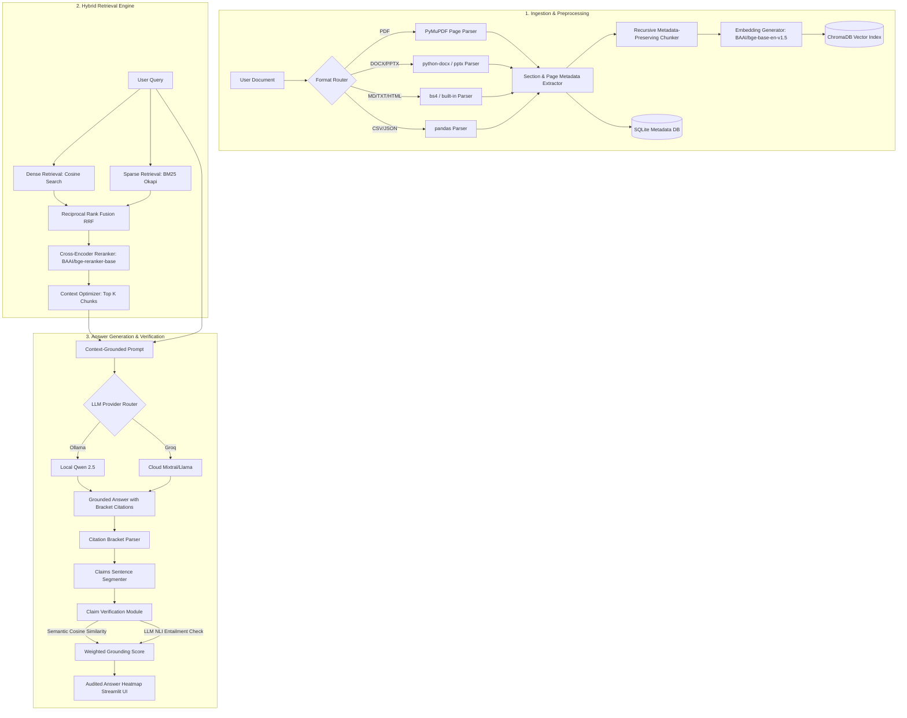

# Domain-Independent Retrieval-Augmented Generation (RAG) with Citation Verifiability

A production-grade, secure, and domain-independent RAG application featuring lexical-semantic hybrid search, Cross-Encoder reranking, and an automated claim-level NLI grounding verification engine. Built entirely using open-source packages and local models, it supports zero-cost local deployment via **Ollama** and cloud deployment via **Groq**.

---

## Key Features

1. **Multi-Format Ingestion**: Ingests PDFs, DOCX, PPTXs, HTML pages, CSVs, JSONs, Markdown, and TXT files, preserving structure (page numbers, section headings) and metadata.
2. **Hybrid Retrieval**: Combines semantic dense retrieval (cosine similarity via ChromaDB) with lexical sparse retrieval (BM25 Okapi) blended using Reciprocal Rank Fusion (RRF).
3. **Cross-Encoder Reranking**: Re-orders fused candidates using `BAAI/bge-reranker-base` to optimize context windows and factual density.
4. **LLM Provider Routing**: Fully configurable model routing between local **Ollama** (e.g. `qwen2.5:7b-instruct`) and cloud-hosted **Groq** APIs (e.g. `mixtral-8x7b-32768`).
5. **Citation Verification Auditor**: Segments responses into claim sentences, evaluates semantic similarity against cited text, and runs NLI (Natural Language Inference) checks to classify claims as `SUPPORTED`, `UNSUPPORTED`, or `CONTRADICTED`.
6. **Security Hardened**: IP-based rate limiting, CORS configuration, and file validation (mime-type, file extension, max 20MB file size limits).
7. **Premium Streamlit Interface**: Visual chat interface highlighting grounded claims (Green), uncited statements (Yellow), and contradictions (Red) with an interactive popover source inspector.
8. **DevOps & Production Ready**: Multi-stage non-root Docker builds, automated GitHub Actions CI/CD workflows, metrics monitoring, and performance latency logging.

---

## System Architecture



---

## Configuration Variables

Centralized configurations are stored and validated at startup in `app/config.py`. They can be overridden via environment variables or a `.env` file:

| Variable | Description | Default |
| :--- | :--- | :--- |
| `LLM_PROVIDER` | Core LLM service router (`ollama` or `groq`) | `ollama` |
| `GROQ_API_KEY` | Developer access token for Groq Cloud API | `""` |
| `LLM_MODEL` | Selected LLM model name (inferred automatically if empty) | Mapped based on provider |
| `OLLAMA_BASE_URL` | Local network connection URL for Ollama service | `http://localhost:11434` |
| `ALLOWED_ORIGINS` | CORS headers allowed hosts (comma-separated list, or `*`) | `*` |
| `RATE_LIMIT_PER_MINUTE` | In-memory API request rate limit count per IP per minute | `60` |
| `MAX_UPLOAD_SIZE` | Maximum upload document size in bytes | `20971520` (20MB) |
| `CHROMA_DB_DIR` | Directory to save ChromaDB persistent vectors | `./data/chroma_db` |
| `SQLITE_DB_PATH` | Directory and filename for SQLite database | `./data/rag_system.db` |
| `HF_HOME` | Target caching folder for model downloads | `./data/hf_cache` |

---

## Local Installation

### Prerequisites
- Python 3.12 or 3.13 installed.
- (Optional) [Ollama](https://ollama.com) running locally for offline execution:
  ```bash
  ollama pull qwen2.5:7b-instruct
  ```

### Step 1: Clone and Configure
1. Create a `.env` file in the project root:
   ```bash
   cp .env.example .env
   ```
2. Adjust settings in `.env` (e.g. set `LLM_PROVIDER=groq` and supply a `GROQ_API_KEY` to run without Ollama).

### Step 2: Install Dependencies
Create a virtual environment and install packages:
```bash
python -m venv venv
source venv/bin/activate  # On Windows: venv\Scripts\activate
pip install -r requirements.txt
```

### Step 3: Run the Services
1. **Start the FastAPI Backend**:
   ```bash
   uvicorn app.main:app --reload --port 8000
   ```
2. **Start the Streamlit Frontend**:
   ```bash
   streamlit run frontend/app.py --server.port 8501
   ```

Open `http://localhost:8501` to access the chat workspace.

---

## Running with Docker (Production Grade)

The project includes a multi-stage `Dockerfile` and `docker-compose.yml` configured with CPU resource constraints, persistent volumes, and container health checks.

To build and launch the containers:
```bash
docker-compose up --build
```

- **Streamlit Frontend**: `http://localhost:8501`
- **FastAPI API Documentation**: `http://localhost:8000/docs`
- **API Health Metrics**: `http://localhost:8000/health`

---

## Production Deployment Guide

### Backend: FastAPI on Render
1. Create a new **Web Service** on Render and link it to your GitHub repository.
2. Configure environment settings:
   - **Environment**: `Python`
   - **Build Command**: `pip install -r requirements.txt`
   - **Start Command**: `uvicorn app.main:app --host 0.0.0.0 --port $PORT`
3. Add the following **Environment Variables** in Render's dashboard:
   - `LLM_PROVIDER=groq` (Recommended for cloud to bypass local Ollama requirements)
   - `GROQ_API_KEY` = *[Your Groq Key]*
   - `ALLOWED_ORIGINS` = *[Your Streamlit Frontend URL]*
   - `LOG_LEVEL=INFO`
4. Attach a **Persistent Disk** on Render mounted at `/workspace/data` to ensure that SQLite databases, ChromaDB vectors, and model weights are retained across deploys. Set `CHROMA_DB_DIR=/workspace/data/chroma_db` and `SQLITE_DB_PATH=/workspace/data/rag_system.db`.

### Frontend: Streamlit Cloud
1. Deploy a new application on [Streamlit Community Cloud](https://share.streamlit.io/).
2. Link the repository, select branch, and set main file path to `frontend/app.py`.
3. In **Advanced Settings**, add the environment variable:
   - `BACKEND_URL` = *[Your Render Web Service URL]*
   - `FRONTEND_TIMEOUT` = `60.0`

---

## Monitoring and Metrics

Access `/health` on the backend API to query live system statistics:
```json
{
  "status": "healthy",
  "llm_available": true,
  "uptime_seconds": 128.45,
  "metrics": {
    "document_count": 2,
    "chunk_count": 86,
    "chroma_vector_count": 86,
    "sqlite_db_size_bytes": 48128,
    "settings": {
      "llm_provider": "GROQ",
      "llm_model": "mixtral-8x7b-32768",
      "rate_limit_limit": 60
    }
  }
}
```

---

## Future Improvements

1. **Visual Semantic Chunking**: Build an interface to inspect how documents are chunked and highlight embeddings in a 2D space.
2. **External Vector Backup**: Integrate Amazon S3 or Google Cloud Storage to back up vector indexes and SQL metadata.
3. **Dynamic Hybrid Search Tuning**: Expose sliders in Streamlit to dynamically adjust retrieval weights (`HYBRID_ALPHA`) and reranking thresholds.
4. **Enhanced Document Layout Parsing**: Integrate OCR models (like PyMuPDF's layout features or Unstructured) to parse tables and image diagrams within papers.
